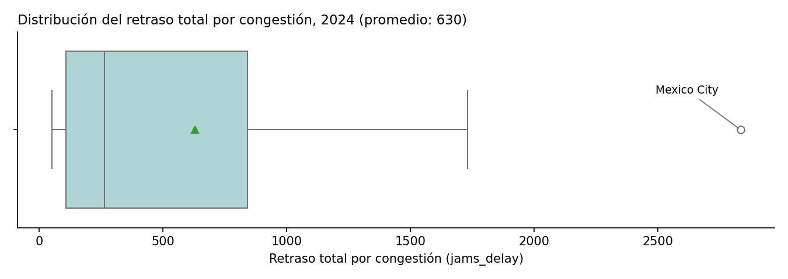
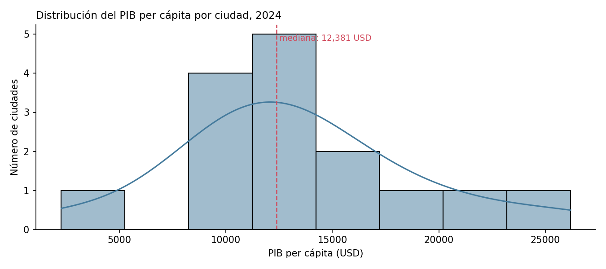
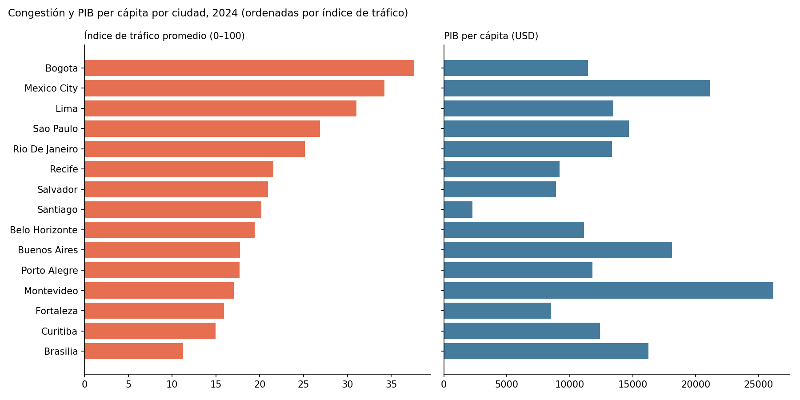
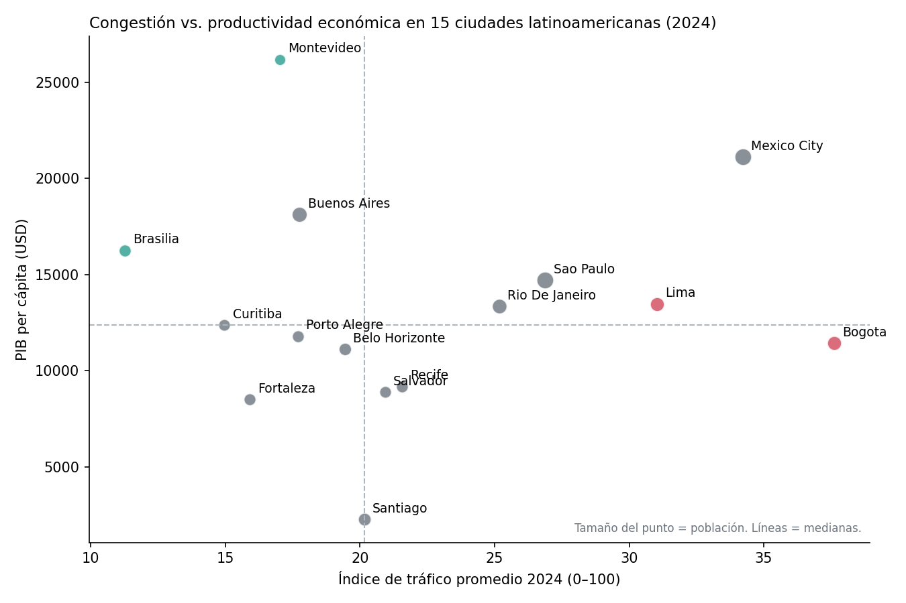
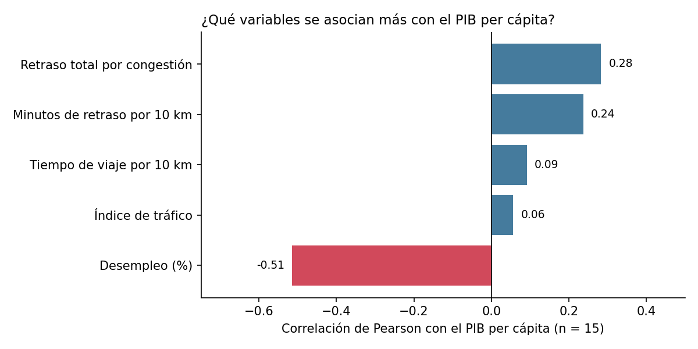

# 🚦 Movilidad urbana y productividad económica en Latinoamérica (2024)


> Análisis exploratorio que integra datos de tráfico (TomTom Traffic Index) y de economía urbana (OECD Cities) para estudiar si las ciudades más congestionadas de Latinoamérica son también las menos productivas.
>
> Proyecto del Bootcamp de Análisis de Datos de TripleTen. El escenario de negocio (un banco de desarrollo que evalúa dónde invertir en transporte) es simulado; los datos son reales.

**Resultado en una línea:** en las 15 ciudades analizadas **no se observa una relación clara entre congestión y PIB per cápita**; la variable más asociada al PIB per cápita fue el **desempleo** (correlación negativa). Bogotá y Lima combinan congestión alta con PIB per cápita medio-bajo.

---

## 📑 Tabla de contenido

**Sección técnica**
- [Introducción](#-introducción)
- [Objetivo](#-objetivo)
- [Datos](#-datos)
- [Tecnologías](#-tecnologías)
- [Metodología](#-metodología)
- [Resultados](#-resultados)
- [Limitaciones](#-limitaciones)
- [Cómo ejecutar](#-cómo-ejecutar)
- [Estructura del repositorio](#-estructura-del-repositorio)

**Sección de negocio**
- [Contexto y problema](#-contexto-y-problema)
- [Preguntas de negocio y respuestas](#-preguntas-de-negocio-y-respuestas)
- [Hallazgos clave](#-hallazgos-clave)
- [Recomendaciones](#-recomendaciones)
- [Próximos pasos](#-próximos-pasos)

---

## 🧭 SECCIÓN TÉCNICA

### 📌 Introducción

La congestión vehicular suele asociarse con actividad económica intensa, pero también con horas de trabajo perdidas. Este proyecto limpia, une y explora dos fuentes públicas para comprobar qué relación existe entre ambas cosas en ciudades latinoamericanas durante 2024.

### 🎯 Objetivo

Construir un dataset único por ciudad y año que combine indicadores de movilidad y de economía, y explorar visualmente y con correlaciones si la congestión se asocia con la productividad económica (PIB per cápita).

### 🗂️ Datos

| Fuente | Contenido | Tamaño original |
| --- | --- | --- |
| **TomTom Traffic Index** | Mediciones periódicas de congestión por ciudad (retraso total, índice de tráfico, longitud y número de embotellamientos, tiempos de viaje por 10 km) | ~1 millón de registros |
| **OECD Cities** | PIB per cápita, desempleo, contaminación (PM2.5) y población por ciudad y año | 30 registros ciudad-año |

**Dataset final** ([`data/processed/ladb_mobility_economy_2024_clean.csv`](data/processed/ladb_mobility_economy_2024_clean.csv)): 15 filas (una por ciudad), 14 columnas, 7 países (Brasil, Colombia, Argentina, Perú, México, Uruguay y Chile), año 2024. Diccionario de variables en [`data/README.md`](data/README.md).

### ⚙️ Tecnologías

- **Lenguaje:** Python
- **Manipulación de datos:** Pandas, NumPy
- **Visualización:** Matplotlib, Seaborn
- **Entorno:** Jupyter Notebook

### 🔬 Metodología

1. **Carga y exploración:** revisión de estructura, tipos de datos y valores faltantes de ambas tablas.
2. **Limpieza y estandarización:**
   - Nombres de columnas a `snake_case`.
   - Fechas de tráfico convertidas a `datetime`.
   - Columnas numéricas de la tabla económica (PIB, desempleo, población) que venían como texto con separadores europeos (`15.782,00`, `6.2%`) convertidas a `float`.
3. **Filtro temporal:** creación de la columna `year` y selección de los registros de 2024.
4. **Agregación:** promedio anual de cada métrica de tráfico por ciudad (de cientos de miles de registros a una fila por ciudad).
5. **Unión:** `pd.merge` de tipo **inner** por `city` y `year`, para conservar solo las ciudades presentes en ambas fuentes (quedaron 15).
6. **Exploración visual y correlaciones:** boxplot, histograma, comparación por ciudad, gráfico de dispersión y correlaciones (Pearson y Spearman) con el PIB per cápita, incluyendo un análisis de sensibilidad sin Santiago.
7. **Exportación** del dataset limpio.

### 📊 Resultados

**Distribución de la congestión (retraso total, `jams_delay`)**: Ciudad de México destaca como valor atípico.



**Distribución del PIB per cápita**



**Congestión y PIB por ciudad**, en dos paneles con escalas independientes (la comparación original en un solo gráfico mezclaba escalas muy distintas y resultaba engañosa).



**Congestión vs. productividad.** Cada punto es una ciudad (el tamaño representa la población). Las líneas punteadas marcan las medianas.



**Correlación de cada variable con el PIB per cápita (n = 15)**



| Variable | Correlación de Pearson con el PIB per cápita |
| --- | --- |
| Desempleo (%) | **-0.51** |
| Retraso total por congestión (`jams_delay`) | 0.28 |
| Minutos de retraso por 10 km (`mins_delay`) | 0.24 |
| Tiempo de viaje por 10 km | 0.09 |
| Índice de tráfico | 0.06 |

Las cifras de Spearman, los valores p y el análisis sin Santiago están en la Parte B del [notebook](notebooks/01_movilidad_productividad_latam.ipynb).

### ⚠️ Limitaciones

- **Muestra pequeña (15 ciudades):** las correlaciones son orientativas; solo la del desempleo se acerca a la significancia estadística convencional (p ≈ 0.05). Una correlación baja aquí no prueba que no exista relación.
- **El retraso total (`jams_delay`) depende del tamaño de la ciudad:** su correlación con la población es 0.88. Por eso el índice de tráfico y los tiempos de viaje son mejores indicadores para comparar ciudades de distinto tamaño.
- **Correlación no es causalidad:** el análisis no permite afirmar que la congestión reduzca o aumente la productividad.
- **Dato atípico en Santiago:** su PIB per cápita (2,277 USD) es muy inferior al del resto de ciudades y no se pudo contrastar con la fuente original. Se conserva en el análisis. Al excluirla, la conclusión principal se mantiene (el desempleo sigue siendo la variable más asociada al PIB, con r = -0.68), aunque algunas correlaciones cambian de magnitud; por ejemplo, los minutos de retraso por 10 km alcanzan una correlación de Spearman de 0.54 (p = 0.04), que se interpreta con cautela por el tamaño de la muestra y el número de pruebas realizadas.
- **Un solo año y datos de tráfico promediados:** no se analizó estacionalidad ni horas pico.
- La columna `pm25_ug_m3` conserva coma decimal como texto en el CSV; se convierte a número en la Parte B del notebook, pero no se usó en el análisis.

### 🚀 Cómo ejecutar

```bash
# Clonar el repositorio
git clone https://github.com/danielmg-data/movilidad-urbana-productividad-latam.git
cd movilidad-urbana-productividad-latam

# Instalar dependencias
pip install pandas numpy scipy seaborn matplotlib jupyter

# Abrir el notebook
jupyter notebook notebooks/01_movilidad_productividad_latam.ipynb
```

> El notebook tiene dos partes. La **Parte A** (preparación de datos) necesita los archivos originales de TomTom (~1 millón de registros) y de la OECD, que no se incluyen por su tamaño; sus resultados ya están guardados en el notebook. La **Parte B** (análisis exploratorio) parte del dataset limpio en `data/processed/` y se puede ejecutar completa. Los gráficos de la carpeta `images/` se generan desde esa parte.

### 🗃️ Estructura del repositorio

```
movilidad-urbana-productividad-latam/
├── README.md
├── LICENSE
├── data/
│   ├── README.md                                    ← diccionario de variables
│   └── processed/
│       └── ladb_mobility_economy_2024_clean.csv     ← dataset final
├── notebooks/
│   └── 01_movilidad_productividad_latam.ipynb       ← análisis completo
└── images/                                          ← gráficos usados en este README
```

---

## 💼 SECCIÓN DE NEGOCIO

### 🏢 Contexto y problema

Un banco de desarrollo (escenario simulado) quiere decidir en qué ciudades latinoamericanas conviene invertir en infraestructura de transporte para mejorar la productividad y el bienestar. Necesita saber si la congestión se asocia con menor productividad y dónde el problema es más crítico.

| Interesado | Qué necesita de este análisis |
| --- | --- |
| Equipo de inversión del banco | Priorizar ciudades para estudios de factibilidad |
| Planificadores urbanos | Entender qué indicadores de movilidad merecen seguimiento |

### ❓ Preguntas de negocio y respuestas

**1. ¿Qué ciudades presentan alta congestión y baja productividad?**
**Bogotá** es el caso más claro: tiene el índice de tráfico más alto de la muestra (37.6) y un PIB per cápita por debajo de la mediana (11,442 USD frente a 12,381). **Lima** tiene el tercer índice más alto (31.0) con un PIB per cápita cercano a la mediana (13,472 USD). Recife y Salvador también quedan en el cuadrante de congestión alta y PIB bajo, pero con una congestión apenas superior a la mediana (21.6 y 20.9 frente a 20.2).

**2. ¿Cuáles combinan movilidad eficiente y economía fuerte?**
**Montevideo** (PIB per cápita más alto, 26,176 USD, con el menor retraso total de la muestra) y **Brasilia** (16,251 USD, con el índice de tráfico más bajo, 11.3). **Buenos Aires** también se ubica en ese cuadrante (18,117 USD, índice 17.8).

**3. ¿Qué variables se relacionan más con el desarrollo urbano?**
De las variables analizadas, el **desempleo** tiene la asociación más fuerte con el PIB per cápita (r = -0.51). Ninguna métrica de tráfico supera 0.28 en valor absoluto con Pearson.

### 💡 Hallazgos clave

- **La riqueza de una ciudad no predice su congestión.** Ciudad de México tiene el mayor retraso total de la muestra (2,833) y también el segundo PIB per cápita más alto (21,111 USD): la congestión aparece tanto en ciudades relativamente ricas como en ciudades de ingreso medio.
- **Bogotá y Lima concentran la combinación más preocupante** de congestión alta e ingreso medio-bajo dentro de la muestra.
- **Hay ciudades con baja congestión en ambos extremos de ingreso** (Montevideo y Brasilia con ingreso alto; Fortaleza con ingreso bajo), lo que refuerza que el tráfico no depende solo del nivel económico.

### ✅ Recomendaciones

1. **Priorizar Bogotá y Lima** para un análisis más profundo, con datos por hora, por corredor y por zona.
2. **Estudiar Ciudad de México por separado:** su congestión extrema coincide con una economía grande, por lo que el interés es el costo económico de esa congestión y no un problema de bajo ingreso.
3. **Tratar con cautela los datos de Santiago:** su PIB per cápita es atípico y no se pudo contrastar con la fuente original; conviene verificarlo antes de usarlo en cualquier priorización.
4. **Añadir al análisis** densidad poblacional, oferta de transporte público y estacionalidad, para distinguir si la congestión viene de exceso de vehículos o de concentración de empleo.

Estas recomendaciones son pasos de análisis, no decisiones de inversión: los datos disponibles (15 ciudades, un año, correlaciones) no bastan para respaldar montos ni proyectos concretos.

### 🔭 Próximos pasos

- Repetir el análisis con varios años para observar tendencias.
- Ampliar la muestra de ciudades y calcular intervalos de confianza.
- Incorporar variables de densidad y de transporte público.
- Construir un dashboard interactivo para explorar los resultados por ciudad.

---

## 👤 Autor

**Daniel Medina Guzmán** · Analista de Datos
[LinkedIn](https://www.linkedin.com/in/danielmg-data) · [GitHub](https://github.com/danielmg-data) · medinaguzman.da@gmail.com
